### Functional Debugging

#### 一.程序的安装和代码的加载
1. 点击安装MDK474.EXE
  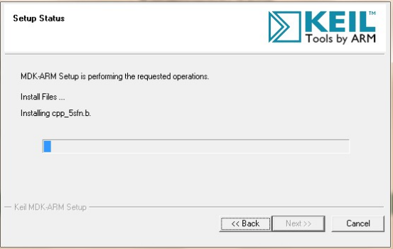
2. 点击安装EE319K_InstallSpring2016.exe
  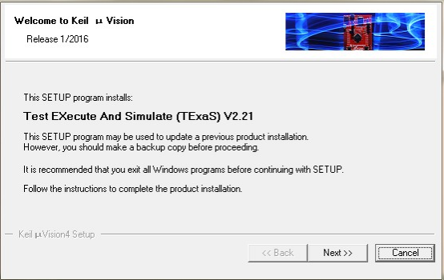
3. 加载FunctionalDEbugging文件夹当中的.uvproj文件
  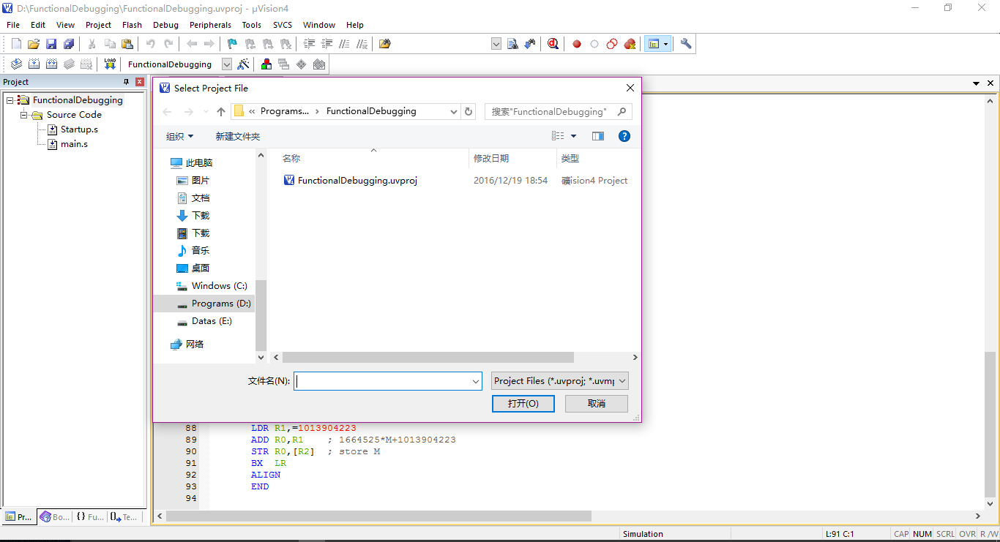

#### 二.程序的基本使用
1. 在StartUp.s当中实现的是基本的CPU的初始化，也会对外围设备进行初始化;在main.s文件当中实现的是主体程序，其中所进行的是程序的主要和关键内容。

  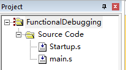  

2. 点击debug->Start/Stop Debug Session，启动调试器，出现调试工具栏，大部分调试功能在工具栏上都有快捷键

  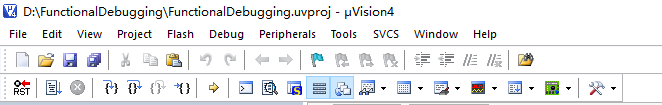

3. 最左的按钮是复位建，第二个为全速运行，第四个为单步运行按钮，左边的侧边栏当中可以看到各个寄存器当前的值，除了观察的话，可以选中寄存器，再点击其数值，则可以对寄存器的值进行手动的修改，或者通过命令行来处理。
  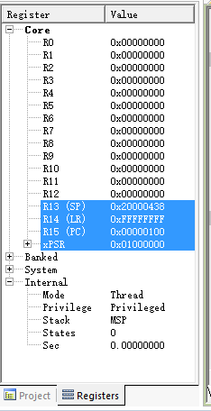

4. 点击View->Memory Windows则可以打开Memeory窗口，在地址栏输入相应的地址，则可以直接从内部寻址，并从RAM的相应地址处开始显示内存。
  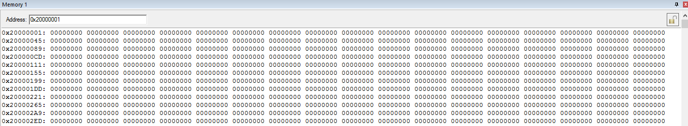

5.  将光标移至相应的程序行， 然后右击选择Insert/Remove Breakpoint则可以设置相应位置的断点
  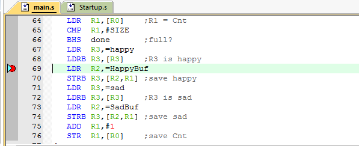

6. 然后按运行程序，当程序运行到断点位置的时候，会自动暂停下来，然后可以按照寄存器当中的地址在内存中查找到相应的值
  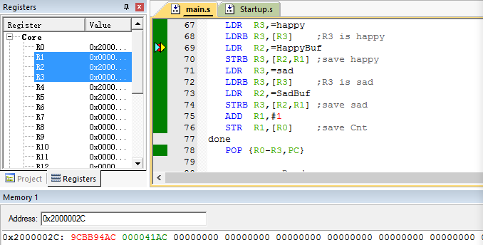  
  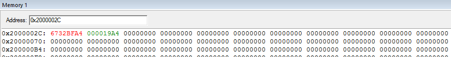
7. 观察Cnt和HappyBuf的变化，打开view->watch可以看到程序当中各个变量的值的变化，可以看到，cnt，happyBuf的初始值都为0；
  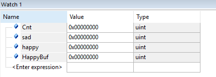

  然后点击运行，就可以观察到这些变量的最终结果
  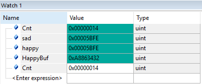
  所以可以得知happyBuf为0xA8863432，Cnt的值为0x00000014
  但实际happyBuf是一个缓存区,而非变量，还是需要找到其地址来看其最终值，在main.s文件当中可以看到这一句讲happyBuf的地址载入到r2寄存器当中，所以可以在此处设置断点，发现运行过后r2的值为0x20000000
  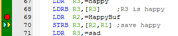  
  在memory窗口当中，可以看到happyBuf所缓存的数组数量正好为14
  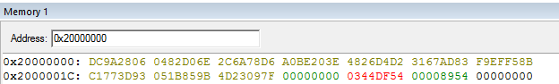
